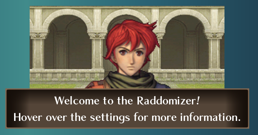
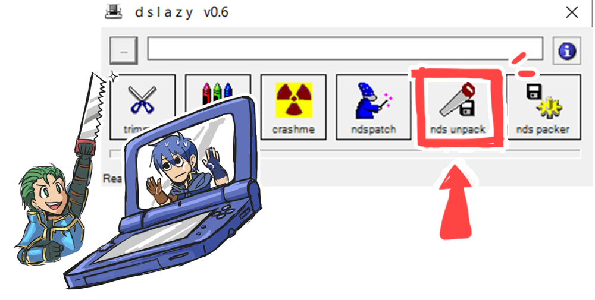
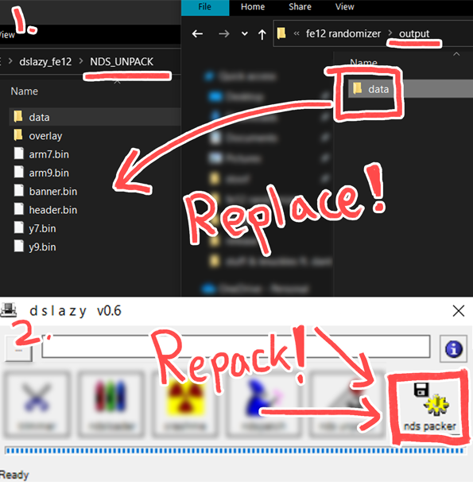
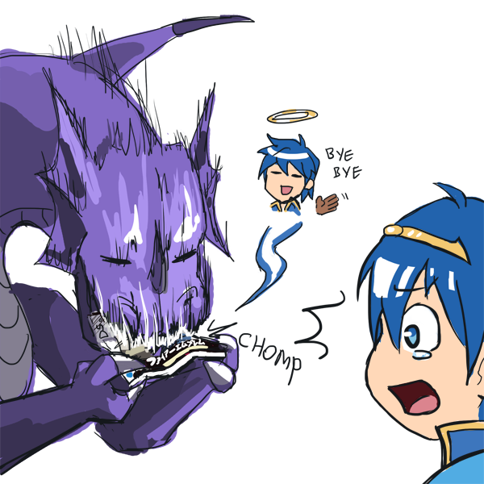

# An FE12 randomizer, complete with a GUI and built-in instructions!
## Get the latest version [here!](https://github.com/eLTehh/Raddomizer/releases/tag/raddomizer) 

## Intro


Raddomizer is a randomizer for New Mystery of the Emblem. The features are lightweight, and easy to understand. No command line stuff or manual decompression — just pop the unpacked ROM folder into the program and it'll randomize things for you.

This randomizer is a joint effort by LT (me) and [Radd](https://twitter.com/Nuthingdude). Coding by LT, documentation by Radd (more info further down in the readme)

It includes a few additional features for an improved gameplay experience, such as removing Prf weapon locks, as well as gendered weapon locks. Also, playable Ballisticians, with their sprites ported over from Shadow Dragon! 

## How to Install
Simply grab the latest release from here: https://github.com/eLTehh/Raddomizer/releases

## Input Format


You'll want an unpacked New Mystery ROM for this one. Patched ROMs with the English translation should work fine, as well. (Not sure about any gameplay mods; if pointers are switched around, Raddomizer might not randomize the classes properly.)

The input directory selected should look like either of the following:
1. The unpacked ROM
```
.
├── data                  
├── overlay                 
├── arm7.bin                    
├── arm9.bin                    
├── banner.bin                   
├── header.bin
├── y7.bin
└── y9.bin
```
2. The FIRST data folder (not the second one)
```
.
├── 2                  
├── 3                 
├── ascii                    
├── av                    
├── b                   
...(and many more folders, including data)
```


A tool you can use to unpack your ROM is [DSLazy](https://www.romhacking.net/utilities/793/). 



## Putting the randomized files back into the game



Once you've specified your output directory (or if not, Raddomizer will output the files in its own installed directory) and clicked Randomize, your files should be ready.

Make a copy of your unpacked ROM folder, drag the data folder (once again, this is the FIRST data folder, not the second!) inside, and allow it to replace existing files.

Then, pack the folder back into a ROM, and enjoy your randomized New Mystery!

## Sample Screenshots
(TO BE ADDED)

## Reporting Errors

You can use Github's Issues page, or any of the threads the randomizer is posted in (FEU, Serenes Forest). 
To attach files on Github, you can drag it inside the comment box.

### **Please include the following while submitting your report:**

*If the randomizer ran into an error while randomizing:*
- The error.log file *(in the same directory as Raddomizer)*
- The settings you used to generate this output
- Randomizer version *(found under About)*

*If the error is found during gameplay:*
- Your randomizerLog.txt file
- The chapter the error occurred in
- Screenshots of the error
- If it's particularly game-breaking, any steps to replicate the error?
- Randomizer version *(found under About)*

*If the randomizer straight up doesn't run*
- The OS you're running it on
- Anything else you think is relevant
- Hopefully this doesn't happen

## Requests for new features
In order to keep myself from being overwhelmed, I will not be taking major requests for the time being! 
Feel free to drop them under Issues, but there's no deadline or guarantee they'll be implemented.

The priority right now is to have a functional randomizer. I may revisit things in the future.

## How did you do all that? Did you document the information somewhere?
Documentation for FE12 can be found in the [Wiki](https://github.com/eLTehh/Raddomizer/wiki), as well as a few Action Replay codes to help improve the gameplay experience. Once again, special thanks to Radd for documenting FE12's data structure!


## Future Roadmap: Awakening randomizer...?
A bunch of code/decompression algorithms have been written for Awakening, though nothing concrete has been done yet. Most of the code could probably be ported over. Holding off on this right now due to some roadblocks with growths encryption, and unsure if other programmers may be working on an Awakening randomizer as I speak.


## Special Thanks

[FE12 Nightmare Modules](https://feuniverse.us/t/fe12-nightmare-modules/9525) by a variety of FEU users

[FE12 Growth Cyphers](https://feuniverse.us/t/fe12-growth-cyphers/6380) by Mrkisuke, and the [original documentation](https://forums.serenesforest.net/index.php?/topic/70880-fe12-growth-rate-cipher-documentation/) by SciresM

[Nintendo LZ compression/decompression](https://github.com/magical/nlzss/blob/master/lzss3.py) by magical

Icons by svgrepo.com

 
